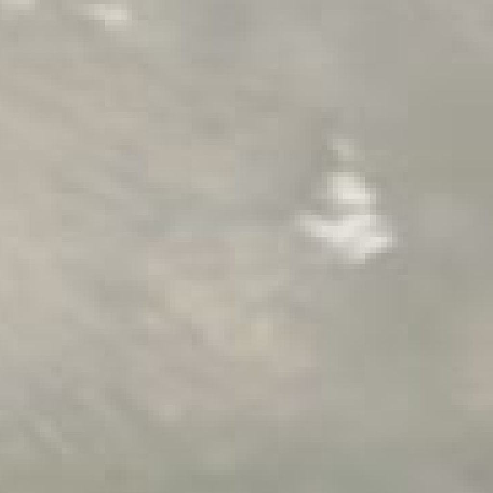

# 👁️ The All-Seeing Sentry
**Target Coordinates:** 6.4, 3.35 | **Scan Date:** 2026-01-14

## ☀️ Daylight Surveillance (Physical Reality)
Tracks construction, deforestation, and coastline changes.
| Current View | Change Detection (Red = Altered) |
| :---: | :---: |
|  |  |

## 🌙 Night Surveillance (Human Activity)
Tracks power outages, urban expansion, and industrial activity.
| Current View | Change Detection (White = Light Change) |
| :---: | :---: |
|  |  |

---
*Powered by GitHub Actions & NASA GIBS*
    